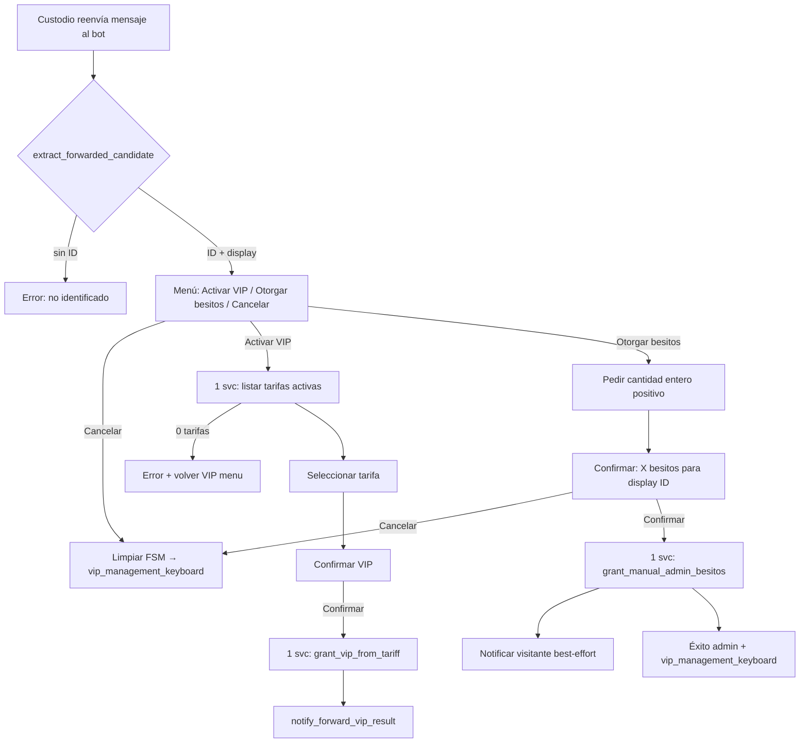

# PLAN: Otorgar besitos manual por reenvío admin (extender flujo VIP forward → menú acción: Activar VIP | Otorgar besitos + confirmación)

**Type:** gsd-planner output (hardener-agile intake)  
**Date:** 2026-06-29  
**Item:** 1/1 (pool único — feature acotada)  
**Fuente:** Petición usuario + patrón existente `handlers/vip_handlers.py` (forward + FSM + confirmación)

**GSD log dedicado:** `.planning/quick/gsd-admin-forward-besitos-grant.log`

---

## SCOPE INTAKE

```
SCOPE INTAKE
- Objetivo: Permitir a Custodios otorgar besitos directamente a un visitante identificado
  por reenvío de mensaje al bot, reutilizando el flujo VIP forward existente.
  Tras detectar el reenvío, mostrar menú: «Activar VIP» | «Otorgar besitos» | Cancelar.
  Rama besitos: cantidad → confirmar → acreditar con TransactionSource.ADMIN.
- Fuente: petición usuario + código actual vip_handlers (extract_forwarded_candidate,
  VIPForwardActivationStates, confirmation_keyboard, notify_forward_vip_result).
- Ítems del pool (≤4): [Item 1 — admin-forward-besitos-grant]
- Restricciones: handlers 1 svc/entrypoint; funcs ≤50 LOC; logging estándar; Lucien voice;
  0 regresión en rama VIP existente; proteger 3 crit + golds atomicity/reaction/daily/invariants.
- Sistemas sensibles: gamificación (credit_besitos + EventBus post-commit), canales-VIP
  (rama VIP sin cambio de grant), narrativa (listeners observacionales only).
- Artefactos: este PLAN + SUMMARY post-exec + tests + decisions append (documentador si pool).
```

---

## 1. Alcance preciso (In / Out)

### En esta entrega

| Área | Cambio |
|------|--------|
| **Detección reenvío** | Admin reenvía mensaje → extraer `user_id` + display (puro existente) → **menú acción** (0 svc) |
| **Rama VIP** | Sin cambio de lógica grant; solo entrada vía botón «Activar VIP» (antes era automático) |
| **Rama besitos** | FSM: cantidad → confirmar → `credit_besitos(..., ADMIN)` → notificar visitante (best-effort) |
| **Servicio** | Método delgado en `BesitoService` para grant manual admin (descripción + ref admin_id) |
| **Tests** | Puros + handlers (mock get_service) + unit besito ADMIN source |
| **Docs** | `decisions.md` append; documentador opcional (pool de 1) |

### Fuera de scope

- Menú gamificación separado sin reenvío (ID manual por texto) — futuro
- Débito manual / ajuste negativo por admin
- Límite diario configurable en BD (usar constante `MAX_ADMIN_BESITO_GRANT` en código)
- Nuevo observer EventBus (credit_besitos ya emite `besitos_awarded`)
- Cambios en `vip_management_keyboard()` (el flujo es por reenvío, no por botón del menú VIP)

---

## 2. Flujo UX (diagrama)



### Textos Lucien (borrador)

**Menú acción (tras reenvío):**
```
🎩 Lucien:

Reenvío detectado de {display} (ID {candidate_id}).

¿Qué desea hacer con este visitante?
```

Botones: `👑 Activar VIP` | `💋 Otorgar besitos` | `❌ Cancelar`

**Pedir cantidad:**
```
Indique cuántos besitos otorgará Diana a {display} (ID {id}):

Ejemplo: 50
```

**Confirmación besitos:**
```
¿Confirmar otorgamiento de {amount} besitos a {display} (ID {id})?
```

**Éxito visitante (best-effort):**
```
🎩 Lucien:

Diana le ha otorgado {amount} besitos como gesto especial.
Su saldo actual: {balance} besitos.
```

---

## 3. Diseño técnico

### 3.1 FSM unificada

Reemplazar/ampliar `VIPForwardActivationStates` → `AdminForwardStates`:

```python
class AdminForwardStates(StatesGroup):
    selecting_action = State()      # NUEVO — menú VIP vs besitos
    vip_selecting_tariff = State()  # antes selecting_tariff
    vip_confirming = State()        # antes confirming
    besitos_waiting_amount = State()
    besitos_confirming = State()
```

**State data keys (compartidos):**
- `forward_target_user_id: int`
- `forward_target_display: str`
- `selected_tariff_id: int` (rama VIP)
- `besito_amount: int` (rama besitos)

### 3.2 Handlers (`handlers/vip_handlers.py`)

| Handler | Svc calls | Notas |
|---------|-----------|-------|
| `process_forwarded_admin_candidate` (renombrar) | **0** | Solo puro + menú acción + set state `selecting_action` |
| `select_forward_action_vip` | **1** | `get_all_tariffs(active_only=True)` |
| `select_forward_action_besitos` | **0** | Transición a `besitos_waiting_amount` |
| `cancel_forward_action` | **0** | Generaliza `cancel_vip_forward_activation` |
| `select_tariff_for_forward_vip` | **0** | Sin cambio lógico; state `vip_confirming` |
| `confirm_forward_vip_activation` | **1** | Sin cambio |
| `process_besitos_amount_for_forward` | **0** | Valida entero; guarda amount; UI confirm |
| `confirm_forward_besitos_grant` | **1** | `grant_manual_admin_besitos` |

**Filtro mensaje reenvío:** mantener `is_admin` + forward_from/forward_origin; **no** llamar VIPService en detección.

**Filtro cantidad:** `@router.message(AdminForwardStates.besitos_waiting_amount, lambda m: is_admin(...))`

### 3.3 Puros nuevos (≤50 LOC, verb+context+result)

| Función | Propósito |
|---------|-----------|
| `build_forward_action_menu_text(display, candidate_id)` | Texto menú acción |
| `build_forward_besitos_amount_prompt(display, candidate_id)` | Pedir cantidad |
| `build_forward_besitos_confirm_text(display, candidate_id, amount)` | Confirmación |
| `build_forward_besitos_success_text(amount, new_balance)` | Éxito admin |
| `build_forward_besitos_visitor_notify(amount, balance)` | Mensaje al visitante |
| `parse_positive_besito_amount(text) -> int \| None` | Valida entero > 0 y ≤ MAX |
| `forward_action_keyboard()` | KB: VIP / besitos / cancelar |

Reutilizar sin cambio: `extract_forwarded_candidate`, helpers VIP notify, `confirmation_keyboard`.

### 3.4 Servicio (`services/besito_service.py`)

```python
MAX_ADMIN_BESITO_GRANT = 10_000  # constante módulo

def grant_manual_admin_besitos(
    self,
    target_user_id: int,
    amount: int,
    admin_id: int,
) -> tuple[bool, int]:
    """
    Otorga besitos por ajuste manual de Custodio.
    Returns: (success, new_balance or 0 on fail)
    """
    if amount <= 0 or amount > MAX_ADMIN_BESITO_GRANT:
        logger.warning(...)
        return False, 0
    desc = f"Otorgamiento manual por Custodio (admin_id={admin_id})"
    ok = self.credit_besitos(
        target_user_id,
        amount,
        TransactionSource.ADMIN,
        description=desc,
        reference_id=admin_id,
    )
    balance = self.get_balance(target_user_id) if ok else 0
    logger.info(f"besito_service | grant_manual_admin_besitos | user_id={admin_id} | target={target_user_id} | amount={amount} | result={'credited' if ok else 'failed'}")
    return ok, balance
```

- Usa `credit_besitos` interno → commit atómico + EventBus best-effort (sin cambio de contrato).
- **0 impacto** en reaction/daily/mission debit paths.

### 3.5 Teclado (`keyboards/inline_keyboards.py`)

```python
def forward_action_keyboard() -> InlineKeyboardMarkup:
    return InlineKeyboardMarkup(inline_keyboard=[
        [InlineKeyboardButton(text="👑 Activar VIP", callback_data="forward_action_vip")],
        [InlineKeyboardButton(text="💋 Otorgar besitos", callback_data="forward_action_besitos")],
        [InlineKeyboardButton(text="❌ Cancelar", callback_data="cancel_forward_action")],
    ])
```

Callbacks de confirmación besitos:
- `confirm_forward_besitos_grant`
- `cancel_forward_action` (compartido)

### 3.6 Notificación visitante

`notify_forward_besitos_result(bot, admin_message, target_user_id, ok, amount, balance, admin_id)` — thin async helper (0 svc), copia patrón `notify_forward_vip_result`:
- Éxito + send OK → mensaje al visitante + edit admin con éxito
- Bloqueo → aviso admin (sin deep link; besitos ya acreditados)
- Fallo credit → error admin, sin send

---

## 4. Fases de implementación (gsd-executor)

### F1 — Puros + teclado + FSM rename (0 behavior en runtime hasta F2)

**Archivos:** `handlers/vip_handlers.py`, `keyboards/inline_keyboards.py`

- [ ] Añadir puros + `forward_action_keyboard`
- [ ] Renombrar states → `AdminForwardStates`
- [ ] Actualizar imports/referencias en handlers VIP existentes
- [ ] Grep: 0 roturas de `VIPForwardActivationStates` en tests

**DoD F1:** ruff clean; tests puros import-inside green.

### F2 — Entrypoint reenvío → menú acción (cambio UX mínimo VIP)

**Archivos:** `handlers/vip_handlers.py`

- [ ] `process_forwarded_admin_candidate`: 0 svc, menú acción, state `selecting_action`
- [ ] `select_forward_action_vip`: 1 svc tarifas → flujo VIP actual
- [ ] `cancel_forward_action`: generaliza cancel
- [ ] Actualizar tests existentes `test_process_forwarded_vip_candidate_*` (ahora esperan menú, no tarifas directo)

**DoD F2:** tests handler forward actualizados; rama VIP end-to-end igual tras elegir «Activar VIP».

### F3 — Rama besitos (FSM + confirm + 1 svc)

**Archivos:** `handlers/vip_handlers.py`, `services/besito_service.py`

- [ ] `select_forward_action_besitos` → waiting_amount
- [ ] `process_besitos_amount_for_forward` → validar + confirm UI
- [ ] `confirm_forward_besitos_grant` → 1 svc + notify
- [ ] `grant_manual_admin_besitos` en BesitoService

**DoD F3:** flujo besitos completo manual en Telegram (smoke mental).

### F4 — Tests

**Archivos:** `tests/handlers/test_vip_handlers.py`, `tests/unit/test_besito_service.py`

| Test | Tipo |
|------|------|
| `test_build_forward_action_*` | Puro |
| `test_parse_positive_besito_amount_*` | Puro (0, neg, >MAX, ok) |
| `test_process_forward_shows_action_menu_0_svc` | Handler |
| `test_forward_vip_path_unchanged_after_action_select` | Handler (regression) |
| `test_besitos_amount_invalid_rejects` | Handler |
| `test_confirm_besitos_calls_exactly_1_svc` | Handler |
| `test_grant_manual_admin_besitos_success` | Unit (ADMIN source tx) |
| `test_grant_manual_admin_besitos_respects_max` | Unit |

**DoD F4:** suite protege rama VIP + nueva rama besitos.

### F5 — Gates + self-check

```bash
pytest -q --tb=line -p no:cov --override-ini="addopts=" \
  -k "vip_handlers or TestBesitoService or cross_service_atomicity or reaction_ or daily_gift or invariants" \
  tests/
```

- [ ] Golds: cross_service_atomicity, reaction_*, daily atomic, invariants — 0 regresiones atribuibles
- [ ] ruff en archivos tocados
- [ ] grep: handlers confirm besitos = 1 `get_service(BesitoService)`; VIP confirm = 1 `get_service(VIPService)`
- [ ] LOC ≤50 en funciones nuevas (inspect)
- [ ] `decisions.md` append Item 36
- [ ] self-check PASSED en gsd log

---

## 5. Riesgos a 3 sistemas críticos

| Sistema | Riesgo | Mitigación |
|---------|--------|------------|
| **Gamificación** | Nuevo path credit sin lock/for_update | Reusa `credit_besitos` (FOR UPDATE + commit) |
| **Gamificación** | EventBus re-entrancy | Observers MUST NOT credit; solo observan ADMIN igual que MISSION |
| **Narrativa** | Listener reacciona a ADMIN award | Contract existente: observational only; gold invariants |
| **Canales-VIP** | Regresión forward VIP | Tests regression; grant path intacto |
| **Atomicidad** | Double grant por retry CB | IdempotencyMiddleware en callbacks confirm |

---

## 6. Archivos exactos

| Archivo | Acción |
|---------|--------|
| `handlers/vip_handlers.py` | Modificar (principal) |
| `keyboards/inline_keyboards.py` | +`forward_action_keyboard` |
| `services/besito_service.py` | +`grant_manual_admin_besitos` + constante MAX |
| `tests/handlers/test_vip_handlers.py` | Actualizar + nuevos casos besitos |
| `tests/unit/test_besito_service.py` | +tests ADMIN grant |
| `decisions.md` | Append post-gates |
| `.planning/phases/36-admin-forward-besitos-grant/PLAN.md` | Este archivo |
| `.planning/quick/gsd-admin-forward-besitos-grant.log` | GSD pre cada edit |

**0 otros archivos** salvo SUMMARY post-exec.

---

## 7. Instrucciones para gsd-executor

1. Leer PLAN + `handlers/vip_handlers.py` + `tests/handlers/test_vip_handlers.py` completos.
2. GSD pre-log **antes de cada edit** en `.planning/quick/gsd-admin-forward-besitos-grant.log`.
3. Copiar patrones al pie de la letra:
   - VIP forward: `extract_forwarded_candidate`, `confirmation_keyboard`, `notify_forward_vip_result`, `with get_service(...) as svc:` exactamente 1 call.
   - Besito: `credit_besitos` + `TransactionSource.ADMIN` + logging `besito_service | ... | user_id=... | result=...`.
   - Puros: docstring «Función pura (sin estado ni side-effects).»
4. **No** mover lógica de grant VIP a handler; **no** llamar `credit_besitos` desde handler directamente (usar `grant_manual_admin_besitos`).
5. Actualizar tests VIP existentes en F2 (breaking change esperado: menú intermedio).
6. self-check PASSED + handoff arch-enforcer → test-guardian → pytest F5.

---

## 8. Handoff

**Ready for:** impact-analyzer (mapa rápido) → **gsd-executor** (este PLAN) → arch-enforcer → test-guardian → pytest F5 → (opcional documentador pool de 1).

**Item 1/1 — admin-forward-besitos-grant.** Pool único iniciado desde petición feature (fuera de HARDENING_ROADMAP clusters; 0/0/0 en código existente salvo UX forward entry).