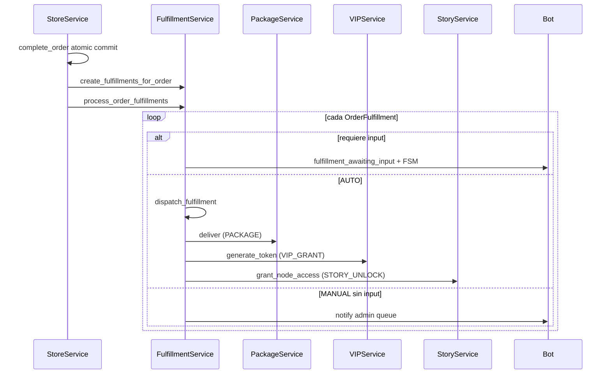
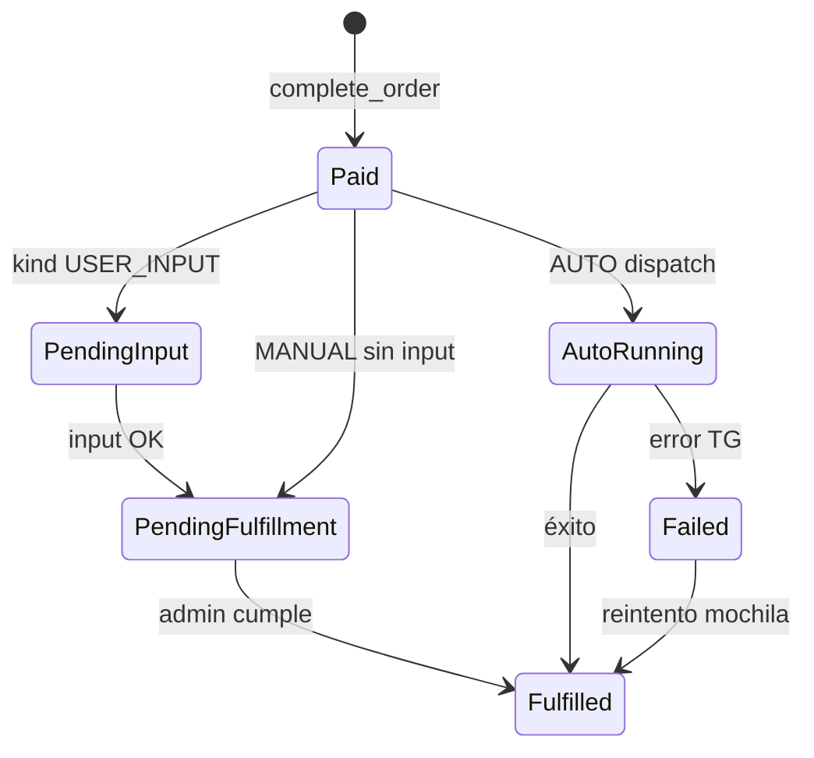

# SPEC: Ecosistema de Fulfillment — Catálogo Kinky

| Campo | Valor |
|-------|-------|
| **Versión** | 1.0 |
| **Fecha** | 2026-06-21 |
| **Estado** | Borrador para aprobación |
| **Fuente catálogo** | [docs/catalogo.md](../../docs/catalogo.md) |
| **Guía de voz** | [docs/guia-estilo.md](../../docs/guia-estilo.md) |
| **Dominio** | Store (+ cross: Package, VIP, Narrative, Backpack) |

---

## 1. Visión y principios

### 1.1 Problema

El bot ya soporta tienda (catálogo, carrito, checkout atómico, entrega de paquetes vía Telegram). El catálogo propuesto en `docs/catalogo.md` introduce **22 productos en 5 tiers** con comportamientos heterogéneos: entrega automática de archivos, desbloqueo narrativo, concesión VIP, privilegios temporales, captura de input del visitante y cumplimiento manual por Diana.

Hoy **todos** los productos se tratan igual: `complete_order` debita besitos, decrementa stock y llama `PackageService.deliver_package_to_user` para cada ítem con `package_id`. No hay distinción AUTO/MANUAL, ni cola de cumplimiento, ni tipos especiales.

### 1.2 Objetivo

Diseñar e implementar un **ecosistema de fulfillment** que permita:

1. Al **Custodio** definir por producto: modo de entrega (AUTO/MANUAL), tipo de fulfillment y configuración asociada.
2. Al **visitante** comprar cualquier ítem del catálogo con feedback claro según el tipo de producto.
3. **Automatizar** lo que el catálogo marca AUTO (paquete, VIP, narrativa, privilegios).
4. **Orquestar** lo MANUAL vía cola híbrida (cumplimiento in-bot o fuera + registro en bot).
5. Exponer **toda compra en la mochila** con estado de fulfillment y acciones contextuales.

### 1.3 Principios no negociables

| # | Principio | Detalle |
|---|-----------|---------|
| P1 | **Pago atómico intacto** | `StoreService.complete_order`: debit PURCHASE + stock `FOR UPDATE` + `OrderStatus.COMPLETED` en un solo commit. Fulfillment **nunca** dentro de esa transacción. |
| P2 | **Fulfillment best-effort** | Fallo de entrega TG o side-effect no revierte cobro ni stock (precedente store domain). |
| P3 | **1 servicio por handler** | Handlers llaman exactamente un service vía `get_service()`. |
| P4 | **Sin DB en handlers** | Toda persistencia vía services → models. |
| P5 | **Funciones ≤ 50 LOC** | Helpers puros para UI larga; naming `verbo + contexto + resultado`. |
| P6 | **Voz centralizada** | Cero strings user-facing en handlers/services; todo en `LucienVoice` ([guia-estilo.md](../../docs/guia-estilo.md)). |
| P7 | **Proteger 3 críticos** | Gamificación (debit PURCHASE), narrativa (unlock sin doble cobro), canales-VIP (grant vía VIPService). |
| P8 | **Manual híbrido** | Cola en bot + Diana puede cumplir fuera + marcar cumplido con notas obligatorias. |

### 1.4 Fuera de alcance (v1)

- Pasarela de pago MXN (solo besitos).
- API externa de entrega.
- Chat en vivo integrado (Círculo de Uno = cola + notas).
- Automatización de edición de descripción del canal Telegram (Kinky Legendario = registro + notas).
- Dominio Promotions (lenguaje diferenciado; no mezclar con store fulfillment).

---

## 2. Voz, UX y guía de estilo

### 2.1 Fuente y arquitectura

- **Esencia narrativa:** [docs/guia-estilo.md](../../docs/guia-estilo.md)
- **Implementación técnica:** [utils/lucien_voice.py](../../utils/lucien_voice.py) — clase `LucienVoice`
- **Auditoría post-implementación:** skill `bot-ui-experience-enhancer`

```
handlers/  → 1× get_service(X)  →  services/  →  LucienVoice.*
                ↓
         build_*_keyboard() puros  →  LucienVoice.*_button()
```

**Prohibido:** literales en español en `handlers/` y `services/` (tests `test_no_hardcoded_spanish_in_services`).

### 2.2 Reglas transversales

| Regla | Aplicación |
|-------|------------|
| Tercera persona, "usted" | Todos los flujos de tienda, fulfillment, mochila |
| Visitante / Custodio / Diana | Usuario final; admin; figura central en copy premium |
| Formato HTML | `🎩 <b>Lucien:</b>` + `<i>` para pausas y observaciones |
| Botones narrativos | Ver anexo A; nunca "OK", "Enviar", "Ver estado" crudo |
| Errores | "Inconveniente", "Permítame consultar con Diana…" |
| Emojis dominio | 🛍️ tienda · 👑 VIP · 📖 narrativa · 💋 besitos · 🌸 Diana |

### 2.3 Convención de nombres en LucienVoice (nuevos métodos)

| Prefijo | Uso |
|---------|-----|
| `store_tier_*` | Intros de catálogo por tier |
| `fulfillment_*` | Post-compra, estados, confirmaciones por kind |
| `fulfillment_input_*` | FSM captura de datos del visitante |
| `fulfillment_admin_*` | Cola custodio, notificaciones enriquecidas |
| `backpack_fulfillment_*` | Detalle compra con estado y acciones |
| `*_button()` | Labels de teclados inline |

### 2.4 Anexo A — Catálogo de touchpoints → LucienVoice

#### Usuario — navegación tienda

| Touchpoint | Método propuesto | Tono / notas |
|------------|------------------|--------------|
| Menú tienda por tiers | `store_tier_menu_intro()` | Lucien presenta el Gabinete |
| Lista tier IMPULSO | `store_tier_impulso_intro()` | Tagline adaptada: curiosidad, compra impulsiva |
| Lista tier DESEO | `store_tier_deseo_intro()` | Corazón del catálogo, acceso |
| Lista tier EXCLUSIVO | `store_tier_exclusivo_intro()` | Completitud, guardar para esto |
| Lista tier RESERVADO | `store_tier_reservado_intro()` | Poder, quien llegó lejos |
| Lista tier MÍTICO | `store_tier_mitico_intro()` | Leyenda, stock limitado del mes |
| Detalle producto | `store_product_detail(name, desc, price, tier)` | Precio en besitos; sin badge técnico AUTO/MANUAL |
| Stock mensual agotado | `store_monthly_cap_reached(product_name)` | Misterio + "este mes ya encontró dueño" |

#### Usuario — compra y post-compra

| Touchpoint | Método propuesto | Cuándo |
|------------|------------------|--------|
| Compra genérica completada | `store_purchase_completed()` | Existente; mantener |
| PACKAGE entregado | `fulfillment_package_delivered(name)` | Post `deliver_package_to_user` OK |
| PACKAGE falló TG | `fulfillment_package_failed_retry_mochila()` | status FAILED; invitar a mochila |
| VIP_GRANT | `fulfillment_vip_grant_message(tariff, token_url)` | Patrón `reward_vip_message` |
| STORY_UNLOCK | `fulfillment_story_unlocked(node_title)` | Capítulo desbloqueado |
| PRIVILEGE_EARLY_ACCESS | `fulfillment_early_access_granted(hours)` | 24h antes del drop |
| PRIVILEGE_DISCOUNT | `fulfillment_discount_granted(pct, expires)` | Cupón activo |
| WAITLIST_ENTRY | `fulfillment_waitlist_joined(position)` | Posición en lista |
| MANUAL sin input | `fulfillment_manual_queued(product_name)` | Diana notificada; paciencia |
| PENDING_INPUT | `fulfillment_awaiting_input(prompt)` | Inicia FSM |

#### Usuario — FSM input (`USER_INPUT_THEN_MANUAL`)

| Touchpoint | Método propuesto |
|------------|------------------|
| Prompt pregunta | `fulfillment_input_prompt_question()` |
| Prompt tema sesión | `fulfillment_input_prompt_director()` |
| Prompt nombre créditos | `fulfillment_input_prompt_credits()` |
| Validación longitud | `fulfillment_input_invalid_length(min, max)` |
| Confirmación enviado | `fulfillment_input_received_queued()` |
| Botón enviar | `fulfillment_input_submit_button()` |

#### Usuario — mochila

| Touchpoint | Método propuesto |
|------------|------------------|
| Lista compras con estado | `backpack_purchases_list()` — **extender** con `fulfillment_status` legible |
| Detalle PACKAGE | `backpack_fulfillment_package_detail(...)` |
| Detalle MANUAL pendiente | `backpack_fulfillment_pending_diana(...)` |
| Detalle input enviado | `backpack_fulfillment_input_submitted(...)` |
| Detalle VIP token | `backpack_fulfillment_vip_token(...)` |
| Detalle privilegio activo | `backpack_fulfillment_privilege_active(...)` |
| Detalle waitlist | `backpack_fulfillment_waitlist_position(...)` |
| Cumplido | `backpack_fulfillment_fulfilled(...)` |
| Reintentar entrega | `backpack_fulfillment_retry_button()` |
| Activar VIP | `backpack_fulfillment_activate_vip_button()` |
| Leer capítulo | `backpack_fulfillment_read_chapter_button()` |

#### Admin — custodio

| Touchpoint | Método propuesto |
|------------|------------------|
| Menú cola entregas | `fulfillment_admin_queue_menu()` |
| Item cola detalle | `fulfillment_admin_queue_item(...)` |
| Notif compra MANUAL | `fulfillment_admin_new_manual_order(...)` |
| Marcar cumplido | `fulfillment_admin_mark_fulfilled_confirm()` |
| Notas obligatorias | `fulfillment_admin_notes_required()` |
| Wizard: elegir tier | `fulfillment_admin_wizard_select_tier()` |
| Wizard: AUTO/MANUAL | `fulfillment_admin_wizard_delivery_mode()` |
| Wizard: kind | `fulfillment_admin_wizard_fulfillment_kind()` |

### 2.5 Checklist por mensaje nuevo (de guía)

- [ ] Saludo o continuidad Lucien (`🎩`)
- [ ] Terminología narrativa (no "orden", "fulfillment", "pending")
- [ ] Referencia a Diana si el producto lo amerita
- [ ] HTML consistente
- [ ] Cierre con apertura a más interacción
- [ ] Botones vía `LucienVoice.*_button()`

---

## 3. Modelo de datos

### 3.1 Enums nuevos

```python
class DeliveryMode(enum.StrEnum):
    AUTO = "auto"
    MANUAL = "manual"


class FulfillmentKind(enum.StrEnum):
    PACKAGE = "package"
    PACKAGE_DEFERRED = "package_deferred"
    USER_INPUT_THEN_MANUAL = "user_input_manual"
    PRIVILEGE_EARLY_ACCESS = "early_access"
    PRIVILEGE_DISCOUNT = "discount"
    STORY_UNLOCK = "story_unlock"
    VIP_GRANT = "vip_grant"
    WAITLIST_ENTRY = "waitlist"
    CHANNEL_HONOR = "channel_honor"
    SCHEDULED_CHAT = "scheduled_chat"


class FulfillmentStatus(enum.StrEnum):
    PENDING_INPUT = "pending_input"
    PENDING_FULFILLMENT = "pending"
    AUTO_IN_PROGRESS = "auto_running"
    FULFILLED = "fulfilled"
    FAILED = "failed"
    CANCELLED = "cancelled"  # solo pre-pago; no post-complete
```

### 3.2 `StoreTier` (nuevo)

| Campo | Tipo | Notas |
|-------|------|-------|
| `id` | PK | |
| `slug` | String unique | `impulso`, `deseo`, `exclusivo`, `reservado`, `mitico` |
| `name` | String | IMPULSO, DESEO, … |
| `tagline` | Text | Del catálogo, adaptado Lucien |
| `price_min` | int | Besitos |
| `price_max` | int | Besitos |
| `order_index` | int | Orden UI |
| `is_active` | bool | |

**Seed (5 filas):** ver sección 8.

### 3.3 Cambios en `StoreProduct`

| Campo | Tipo | Nullable | Notas |
|-------|------|----------|-------|
| `delivery_mode` | DeliveryMode | NO | default AUTO |
| `fulfillment_kind` | FulfillmentKind | NO | default PACKAGE |
| `tier_id` | FK StoreTier | YES | |
| `package_id` | FK Package | **YES** (migración 2) | Obligatorio si kind usa paquete |
| `story_node_id` | FK StoryNode | YES | STORY_UNLOCK |
| `tariff_id` | FK Tariff | YES | VIP_GRANT |
| `fulfillment_config` | JSON | YES | Ver 3.6 |
| `monthly_stock_cap` | int | YES | NULL = sin límite mensual; Tier 5 |
| `sort_order` | int | default 0 | Dentro del tier |

**Compatibilidad:** productos existentes → `delivery_mode=AUTO`, `fulfillment_kind=PACKAGE`, `package_id` se mantiene obligatorio hasta migración 2.

### 3.4 `OrderFulfillment` (nuevo)

| Campo | Tipo | Notas |
|-------|------|-------|
| `id` | PK | |
| `order_item_id` | FK unique | 1 fulfillment por línea de orden |
| `user_id` | BigInteger | telegram_id |
| `product_id` | FK | |
| `fulfillment_kind` | FulfillmentKind | snapshot al comprar |
| `status` | FulfillmentStatus | |
| `user_input` | JSON/Text | pregunta, tema, nombre |
| `admin_notes` | Text | obligatorio al marcar cumplido (híbrido) |
| `fulfilled_by` | BigInteger | admin telegram_id |
| `fulfilled_at` | DateTime TZ | |
| `auto_result` | JSON | token_code, node_id, errors TG |
| `retry_count` | int | default 0 |
| `last_attempt_at` | DateTime TZ | |
| `created_at` | DateTime TZ | |

**Índices:** `(status)`, `(user_id, status)`, `(product_id, created_at)` para stock mensual.

### 3.5 `StorePrivilege` (nuevo)

| Campo | Tipo | Notas |
|-------|------|-------|
| `id` | PK | |
| `user_id` | BigInteger | |
| `product_id` | FK | |
| `order_fulfillment_id` | FK | |
| `privilege_type` | enum | `early_access`, `discount` |
| `config` | JSON | `hours`, `discount_pct`, `drop_id` |
| `expires_at` | DateTime TZ | |
| `consumed_at` | DateTime TZ | nullable |

### 3.6 `StoreWaitlistEntry` (nuevo)

| Campo | Tipo | Notas |
|-------|------|-------|
| `id` | PK | |
| `user_id` | BigInteger | |
| `product_id` | FK | La Lista |
| `order_fulfillment_id` | FK | |
| `position` | int | auto-increment por producto |
| `joined_at` | DateTime TZ | |
| `status` | enum | `active`, `fulfilled`, `expired` |

### 3.7 Esquema `fulfillment_config` (JSON por kind)

```json
// USER_INPUT_THEN_MANUAL
{
  "input_type": "question" | "session_theme" | "credit_name",
  "min_length": 3,
  "max_length": 500,
  "prompt_key": "fulfillment_input_prompt_question"
}

// PRIVILEGE_EARLY_ACCESS
{ "early_access_hours": 24, "drop_reference": "next_promotion" }

// PRIVILEGE_DISCOUNT
{ "discount_pct": 20, "ttl_days": 30 }

// CHANNEL_HONOR
{ "honor_duration_days": 30 }

// SCHEDULED_CHAT
{ "duration_minutes": 30 }

// monthly (cualquier kind en Tier 5)
{ "monthly_reset_cron": "0 0 1 * *", "timezone": "America/Mexico_City" }
```

### 3.8 Diagrama ER (resumen)

```
StoreTier 1──* StoreProduct
StoreProduct *──1 Package (opcional)
StoreProduct *──1 StoryNode (opcional)
StoreProduct *──1 Tariff (opcional)
OrderItem 1──1 OrderFulfillment
OrderFulfillment 1──* StorePrivilege (0..1)
OrderFulfillment 1──* StoreWaitlistEntry (0..1)
```

---

## 4. FulfillmentService

### 4.1 Ubicación y responsabilidad

- **Archivo:** `services/fulfillment_service.py`
- **Dominio:** Store (documentar en `services/store/CLAUDE.md`)
- **No reemplaza** `StoreService`; orquesta post-commit.

### 4.2 API pública

```python
class FulfillmentService:
    def create_fulfillments_for_order(self, order_id: int) -> list[OrderFulfillment]
    async def process_order_fulfillments(self, bot, order_id: int) -> None
    async def dispatch_fulfillment(self, bot, fulfillment_id: int) -> tuple[bool, str]
    def get_fulfillment_for_order_item(self, order_item_id: int) -> OrderFulfillment | None
    def get_user_fulfillments(self, user_id: int, limit: int) -> list[OrderFulfillment]
    def submit_user_input(self, fulfillment_id: int, user_id: int, text: str) -> tuple[bool, str]
    async def admin_mark_fulfilled(
        self, bot, fulfillment_id: int, admin_id: int, notes: str, *, package_id: int | None = None
    ) -> tuple[bool, str]
    async def admin_deliver_package_from_queue(self, bot, fulfillment_id: int, package_id: int, admin_id: int) -> tuple[bool, str]
    def get_pending_queue(self, *, status: FulfillmentStatus | None, limit: int) -> list[OrderFulfillment]
    def count_monthly_sales(self, product_id: int, year: int, month: int) -> int
    def is_monthly_cap_available(self, product_id: int) -> bool
```

### 4.3 Flujo post-compra



### 4.4 Handlers internos (strategy)

| Kind | AUTO | MANUAL / híbrido |
|------|------|------------------|
| `PACKAGE` | `PackageService.deliver_package_to_user` | N/A |
| `PACKAGE_DEFERRED` | N/A | Admin elige paquete en cola → deliver |
| `USER_INPUT_THEN_MANUAL` | Tras input → cola | Admin responde o marca cumplido + notas |
| `STORY_UNLOCK` | `StoryService.grant_node_access` (nuevo) | N/A |
| `VIP_GRANT` | Token + mensaje (patrón RewardService) | N/A |
| `PRIVILEGE_EARLY_ACCESS` | Crear `StorePrivilege` | N/A |
| `PRIVILEGE_DISCOUNT` | Crear cupón en `StorePrivilege` | N/A |
| `WAITLIST_ENTRY` | Crear entrada + posición | Admin ve lista |
| `CHANNEL_HONOR` | Cola | Marcar cumplido + notas (canal externo) |
| `SCHEDULED_CHAT` | Cola | Marcar cumplido + notas contacto |

### 4.5 `StoryService.grant_node_access` (nuevo método)

**Contrato:**

- Parámetros: `user_id`, `node_id`, `reference_fulfillment_id`
- Marca nodo accesible en `UserStoryProgress` sin `debit_besitos`
- **No** avanza historia principal ni dispara achievements de progreso normal
- Idempotente: segunda llamada con mismo `reference_fulfillment_id` → OK sin duplicar
- Log: `story_service | grant_node_access | user_id | node_id | result=ok`

### 4.6 Idempotencia y reintentos

| Caso | Comportamiento |
|------|----------------|
| Re-`complete_order` idempotente | No crear fulfillments duplicados (`order_item_id` unique) |
| AUTO falla TG | `status=FAILED`; mochila permite reintento |
| VIP token ya generado | Reutilizar token en `auto_result`; no duplicar |
| Input ya enviado | Rechazar segundo submit |

### 4.7 Integración con StoreService

**Cambio en `_complete_order_post_commit_side_effects`:**

```python
# Reemplazar _deliver_order_packages_best_effort directo por:
with get_service(FulfillmentService) as fulfill_svc:
    fulfill_svc.create_fulfillments_for_order(order.id)
    await fulfill_svc.process_order_fulfillments(bot, order.id)
```

`_decrement_stock_for_order` deja de construir `package_ids` para entrega; fulfillment lee producto/kind por ítem.

### 4.8 Stock mensual

- **Pre-compra:** `StoreService.direct_purchase` / `create_order` consultan `FulfillmentService.is_monthly_cap_available(product_id)`.
- **Conteo:** fulfillments `FULFILLED` o `PENDING_FULFILLMENT` del mes calendario (TZ `America/Mexico_City`) cuentan contra cap.
- **Reset:** job scheduler día 1 00:00 — no borra historial; habilita nuevas compras si `monthly_stock_cap` aplica.

---

## 5. Flujos de usuario

### 5.1 Navegación catálogo por tier

```
/shop → Ver por tiers → Tier X → Lista productos → Detalle → Comprar
```

- Reemplaza o complementa "Ver catálogo completo" con vista por tier ordenada (`StoreTier.order_index`, `StoreProduct.sort_order`).
- Productos sin stock mensual: ocultos o mensaje `store_monthly_cap_reached`.

### 5.2 Compra

Sin cambio en fase atómica. Mensaje post-compra **depende de `fulfillment_kind`** (no mensaje genérico único).

### 5.3 FSM input post-compra (`PurchaseInputStates`)

**Trigger:** `FulfillmentStatus.PENDING_INPUT` tras compra.

```
Compra OK
  → Lucien: fulfillment_awaiting_input(prompt)
  → Visitante escribe texto
  → FulfillmentService.submit_user_input
  → Lucien: fulfillment_input_received_queued
  → status → PENDING_FULFILLMENT
  → Notif admin
```

**Validación:** `min_length` / `max_length` desde `fulfillment_config`.

### 5.4 Diagrama estados (visitante)



### 5.5 Wireframe — detalle producto MANUAL (ej. Una Sola Pregunta)

```
🎩 Lucien:

*i>Diana escucha con atención quien se atreve a preguntar…</i>*

**Una Sola Pregunta**
Escríbala. Ella responderá en audio — una sola, pero de verdad.

💋 300 besitos

[ 🌸 Adquirir este privilegio ]
[ 🔙 Volver al tier DESEO ]
```

### 5.6 Wireframe — post-compra MANUAL

```
🎩 Lucien:

*i>Excelente elección. Su solicitud ya viaja hacia Diana…</i>*

Lucien ha registrado su adquisición. Ella fue notificada;
cuando el momento sea el adecuado, encontrará la respuesta en su mochila.

👉 Revise **Sus tesoros adquiridos** cuando lo desee.

[ 🎒 Ir a la mochila ]
[ 🛍️ Seguir explorando ]
```

---

## 6. Flujos admin (Custodio)

### 6.1 Wizard producto extendido

Pasos actuales + nuevos (después de descripción):

1. **Tier** — selección IMPULSO…MÍTICO
2. **Delivery mode** — AUTO / MANUAL
3. **Fulfillment kind** — lista filtrada (ej. MANUAL → kinds manuales/híbridos)
4. **Payload** — paquete / nodo / tarifa / config JSON / stock mensual
5. **Precio** — besitos
6. **Stock** — convención actual (-1 ilimitado, 0 agotado) + `monthly_stock_cap` si aplica
7. **Confirmación**

### 6.2 Panel cola de entregas

**Entry:** menú admin tienda → "📬 Cola de entregas del reino"

**Filtros:**

- Pendientes de input (visitante aún no envía)
- Pendientes de Diana
- Fallidos (reintento auto)
- Cumplidos (historial reciente)

### 6.3 Wireframe — item cola

```
🎩 Lucien:

*i>Un visitante aguarda atención del sanctum…</i>*

**Una Sola Pregunta** · Orden #142
Visitante: @alias (id: …)
Comprado: 21/06/2026 14:32

📝 Su pregunta:
«¿Cuál fue tu primer cosplay favorito?»

Estado: Pendiente de Diana

[ 📦 Entregar paquete ]  [ ✍️ Responder ]
[ ✅ Marcar cumplido (notas) ]
[ 👤 Contactar visitante ]
```

**Marcar cumplido (híbrido):** FSM notas obligatorias (`fulfillment_admin_notes_required`). Si cumplió fuera del bot, solo notas + timestamp + `fulfilled_by`.

### 6.4 Notificación admin enriquecida

Extender o complementar `store_admin_purchase_notification`:

- Incluir `fulfillment_kind`, `delivery_mode`
- Si MANUAL: botón deep-link a item de cola
- Si USER_INPUT pendiente: indicar "aguardando pregunta del visitante"

---

## 7. Mochila como inventario de compras

### 7.1 Contrato

1. **Toda compra `COMPLETED`** genera `OrderFulfillment` y aparece en mochila **inmediatamente** (no esperar entrega).
2. **`BackpackService.get_user_purchases`** enriquecido con:
   - `fulfillment_id`, `fulfillment_status`, `fulfillment_kind`
   - `status_display` (texto Lucien, no enum crudo)
   - `actions_available[]` — claves para botones
3. **Acciones** delegan a `FulfillmentService` (BackpackService orquesta 1 llamada; handler llama 1 service).

### 7.2 Acciones por kind en mochila

| Kind | Acciones en detalle |
|------|---------------------|
| PACKAGE | Reintentar entrega (`FAILED` o siempre disponible) |
| PACKAGE_DEFERRED | Ver estado; mensaje "Diana prepara su elección" |
| USER_INPUT_THEN_MANUAL | Ver input enviado + estado cola |
| VIP_GRANT | Activar VIP (link token) |
| STORY_UNLOCK | Leer capítulo → deep link narrativa |
| PRIVILEGE_* | Ver beneficio y expiración |
| WAITLIST_ENTRY | Ver posición |
| CHANNEL_HONOR / SCHEDULED_CHAT | Estado + notas admin cuando cumplido |

### 7.3 Wireframe — compra pendiente Diana en mochila

```
🎩 Lucien:

*i>El tesoro adquirido aguarda el toque de Diana…</i>*

**Una Sola Pregunta**
📅 21/06/2026 · 💋 300 besitos

Estado: *En manos de Diana*

Su pregunta ya fue registrada. Lucien le avisará
cuando la respuesta esté lista.

[ 🔙 Volver a compras ]
```

### 7.4 Cambios en handlers

- [`handlers/backpack_handler.py`](handlers/backpack_handler.py): usar `LucienVoice.backpack_fulfillment_*`; eliminar strings hardcoded en detalle compra.
- Nuevos callbacks: `BackpackFulfillmentRetryCallback`, `BackpackActivateVipCallback`, etc.

---

## 8. Seed del catálogo (22 productos)

### 8.1 Tiers

| slug | name | tagline (catálogo) | price_min | price_max | order |
|------|------|-------------------|-----------|-----------|-------|
| impulso | IMPULSO | Vende curiosidad · Compra sin pensar | 50 | 120 | 1 |
| deseo | DESEO | Vende acceso · El corazón del catálogo | 150 | 350 | 2 |
| exclusivo | EXCLUSIVO | Vende completitud · Vale guardar para esto | 400 | 700 | 3 |
| reservado | RESERVADO | Vende poder · Solo para los que llegaron lejos | 800 | 1500 | 4 |
| mitico | MÍTICO | Vende leyenda · Stock limitado · Solo existe este mes | 2000 | 5000 | 5 |

### 8.2 Tabla completa de productos

| # | Nombre | Tier | Precio | Mode | Kind | Stock | Config / deps |
|---|--------|------|--------|------|------|-------|---------------|
| 1 | Detrás del Velo | impulso | 50 | AUTO | PACKAGE | -1 | `package_id` TBD |
| 2 | La Mañana de Diana | impulso | 65 | AUTO | PACKAGE | -1 | video package |
| 3 | El Primer Susurro | impulso | 80 | AUTO | PACKAGE | -1 | audio package |
| 4 | 30s del Sensorium | impulso | 90 | AUTO | PACKAGE | -1 | audio package |
| 5 | Kinky Stamps | impulso | 70 | AUTO | PACKAGE | -1 | stickers/docs |
| 6 | Fragmento Temático | deseo | 200 | AUTO | PACKAGE | -1 | 10-15 fotos |
| 7 | El Corto | deseo | 250 | AUTO | PACKAGE | -1 | video 2min |
| 8 | Primero Tú | deseo | 160 | AUTO | PRIVILEGE_EARLY_ACCESS | -1 | `early_access_hours: 24` |
| 9 | Una Sola Pregunta | deseo | 300 | MANUAL | USER_INPUT_THEN_MANUAL | -1 | `input_type: question` |
| 10 | Sesión Completa | exclusivo | 500 | AUTO | PACKAGE | -1 | 25+ fotos |
| 11 | El Largo | exclusivo | 600 | AUTO | PACKAGE | -1 | video 7min |
| 12 | Ventaja Kinky | exclusivo | 450 | MANUAL | PRIVILEGE_EARLY_ACCESS + DISCOUNT* | -1 | Ver nota abajo |
| 13 | Fragmento de la Historia | exclusivo | 700 | AUTO | STORY_UNLOCK | -1 | `story_node_id` TBD |
| 14 | La Elección de Diana | reservado | 1000 | MANUAL | PACKAGE_DEFERRED | -1 | sin package fijo |
| 15 | Kinky Legendario | reservado | 850 | MANUAL | CHANNEL_HONOR | -1 | `honor_duration_days: 30` |
| 16 | El Sensorium Completo | reservado | 1200 | AUTO | PACKAGE | -1 | video+audio |
| 17 | La Lista | reservado | 1500 | MANUAL | WAITLIST_ENTRY | -1 | — |
| 18 | El Director | mitico | 3000 | MANUAL | USER_INPUT_THEN_MANUAL | monthly: 2 | `input_type: session_theme` |
| 19 | En Los Créditos | mitico | 2200 | MANUAL | USER_INPUT_THEN_MANUAL | monthly: 3 | `input_type: credit_name` |
| 20 | Mes a Su Lado | mitico | 2500 | AUTO | VIP_GRANT | monthly: 3 | `tariff_id` 30 días |
| 21 | Lo Que Nadie Ha Visto | mitico | 4000 | AUTO | PACKAGE | monthly: 2 | package exclusivo |
| 22 | Círculo de Uno | mitico | 5000 | MANUAL | SCHEDULED_CHAT | monthly: 1 | `duration_minutes: 30` |

**Nota Ventaja Kinky:** producto compuesto — `fulfillment_kind` primario `PRIVILEGE_EARLY_ACCESS` con `fulfillment_config.companion_discount_pct: 20` y dispatcher que crea **dos** `StorePrivilege` en un mismo fulfillment, o kind dedicado `PRIVILEGE_COMBO` (decisión implementación oleada D; SPEC permite extensión enum).

**Script:** `scripts/seed_catalog.py` — idempotente, placeholders `package_id`/`story_node_id`/`tariff_id` configurables por admin tras seed.

---

## 9. Integraciones cross-domain

### 9.1 PackageService

- Sin cambios en API de entrega.
- FulfillmentService es el único caller post-compra (no `_deliver_order_packages_best_effort` directo).

### 9.2 VIPService

- `generate_token(tariff_id)` + mensaje con `t.me/bot?start=TOKEN`
- No bypass de `redeem_token` para visitante final.
- Evento `EVENT_VIP_ACTIVATED` — emitir post-redeem (existente).

### 9.3 StoryService

- Nuevo `grant_node_access` (sección 4.5).
- Handler narrativa: respetar nodo ya desbloqueado por compra.

### 9.4 BesitoService

- Sin cambios en debit PURCHASE.
- Descuentos (`PRIVILEGE_DISCOUNT`): validar cupón en `create_order` **antes** de commit; aplicar en `total_price` con registro en `StorePrivilege.consumed_at`.

### 9.5 SchedulerService

- Job `reset_monthly_store_caps` — cron `0 0 1 * *`, TZ Mexico City.
- Log: `scheduler | monthly_store_cap_reset | month=YYYY-MM | result=ok`

### 9.6 Early access hook

- Al publicar drop (promoción/nuevo producto): `FulfillmentService.notify_early_access_holders(drop_id)` — best-effort, no bloquea publicación.

---

## 10. Migración y compatibilidad

### 10.1 Alembic — migración 1

- Crear `store_tiers`, `order_fulfillments`, `store_privileges`, `store_waitlist_entries`
- Añadir columnas a `store_products` con defaults (`delivery_mode=auto`, `fulfillment_kind=package`)
- `package_id` sigue NOT NULL

### 10.2 Alembic — migración 2

- `store_products.package_id` → nullable
- Check constraint o validación service: kind PACKAGE/PACKAGE_DEFERRED requiere package cuando AUTO o al entregar

### 10.3 Datos existentes

- Productos legacy: AUTO + PACKAGE; comportamiento idéntico al actual.
- Órdenes históricas sin `OrderFulfillment`: mochila sigue mostrando compras; opcional backfill solo si `package_id` presente (no obligatorio v1).

---

## 11. Testing

### 11.1 Gold tests (obligatorios)

| ID | Escenario | Contrato |
|----|-----------|----------|
| G1 | PACKAGE AUTO compra | debit sobrevive; fulfillment FULFILLED o FAILED sin rollback order |
| G2 | VIP_GRANT | un token por fulfillment; idempotente |
| G3 | STORY_UNLOCK | nodo accesible; cero debit besitos en grant |
| G4 | USER_INPUT → MANUAL | transiciones PENDING_INPUT → pending → fulfilled |
| G5 | monthly cap | bloquea compra al agotar; permite mes siguiente |
| G6 | atomicity | fulfillment nunca en mismo commit que debit |
| G7 | mochila | compra visible con status_display correcto post-complete |
| G8 | voz | grep services: 0 strings español user-facing fuera LucienVoice |

### 11.2 Comandos verificación (PLAN)

```bash
pytest tests/unit/test_fulfillment_service.py tests/unit/test_store_service.py \
  tests/unit/test_backpack_service.py -q --tb=line -p no:cov --override-ini="addopts="

pytest tests/unit/test_store_service.py -k "complete_order or atomic" -q --tb=line
```

---

## 12. Oleadas de implementación

| Oleada | Entregable | Productos / scope |
|--------|------------|-------------------|
| **A** | Modelos, migrations, FulfillmentService scaffold, refactor PACKAGE AUTO, LucienVoice base | 11 productos paquete |
| **B** | Cola admin, USER_INPUT FSM, PACKAGE_DEFERRED, notifs, mochila status | 6 MANUAL input/deferred |
| **C** | VIP_GRANT, STORY_UNLOCK, grant_node_access | Mes a Su Lado, Fragmento Historia |
| **D** | Privilegios early/discount, waitlist, channel honor, scheduled chat, Ventaja Kinky combo | Primero Tú, Ventaja Kinky, La Lista, Legendario, Círculo |
| **E** | Stock mensual, scheduler, seed 22 productos, UI tiers, auditoría bot-ui-experience-enhancer | Tier 5 + catálogo completo |

Cada oleada: tests G* aplicables + sin regresión `complete_order` atomic gold.

---

## 13. Handlers y archivos nuevos (inventario)

| Archivo | Acción |
|---------|--------|
| `services/fulfillment_service.py` | Nuevo |
| `handlers/fulfillment_admin_handlers.py` | Nuevo |
| `handlers/store_user_handlers.py` | Tier nav, FSM input, LucienVoice |
| `handlers/store_admin_handlers.py` | Wizard extendido |
| `handlers/backpack_handler.py` | Fulfillment status + acciones |
| `models/models.py` | Enums + modelos |
| `utils/lucien_voice.py` | Métodos anexo A |
| `keyboards/callback_data.py` | Callbacks fulfillment/backpack |
| `services/store/CLAUDE.md` | Documentar dominio |
| `scripts/seed_catalog.py` | Seed idempotente |
| `bot.py` | Registrar `fulfillment_admin_router` |

---

## 14. Decisiones abiertas (defaults recomendados)

| # | Pregunta | Default SPEC |
|---|----------|--------------|
| D1 | Ventaja Kinky: un kind o dos privileges | `PRIVILEGE_EARLY_ACCESS` + config `companion_discount_pct`; dispatcher crea 2 filas `StorePrivilege` |
| D2 | Backfill fulfillments históricos | No en v1 |
| D3 | Carrito multi-ítem con kinds mixtos | Soportado; un `OrderFulfillment` por `OrderItem` |
| D4 | ¿Badge AUTO/MANUAL visible al visitante? | No; solo copy Lucien distinto post-compra |
| D5 | Tier como `Category` existente vs `StoreTier` | `StoreTier` dedicado (tagline y rango precio) |

---

## 15. Aprobación

| Rol | Nombre | Fecha | OK |
|-----|--------|-------|-----|
| Producto / Diana | | | |
| Implementación | | | |

---

*Documento generado para implementación del catálogo en [docs/catalogo.md](../../docs/catalogo.md). Tras aprobación, iniciar oleada A sin modificar contratos atomicidad de `complete_order`.*